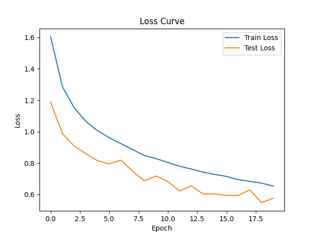
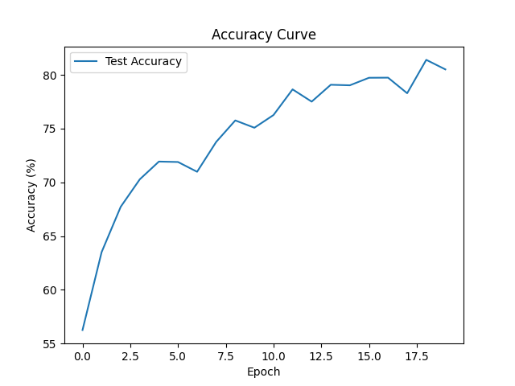

### Improve simple-image-clssification

## 🚀 Improvements

Compared to the baseline CNN, the following improvements were applied:

- Data augmentation (random crop, horizontal flip)
- Batch normalization for stable training
- Dropout to reduce overfitting
- Increased training epochs (10 → 20)

These changes significantly improved generalization performance.

| Model | Accuracy |
|------|----------|
| Baseline SimpleCNN | 74.68% |
| ImprovedCNN | **81.40%** |

---

## 📈 Analysis

- Training becomes more stable with batch normalization  
- Data augmentation reduces overfitting  
- Dropout improves generalization  

## 📊 Training Visualization

### Loss Curve

### Accuracy Curve

The improved model continues to learn effectively beyond 10 epochs,
achieving peak performance at epoch 19.

---

## 📌 Key Improvement

+6.72% accuracy gain over baseline

## ⭐Inference

Prediction: cat

Confidence: 0.8645

Prediction: dog

Confidence: 0.8596

Prediction: airplane

Confidence: 0.9998

Prediction: automobile

Confidence: 1.0000

Prediction: bird

Confidence: 0.8870

Prediction: deer

Confidence: 0.5277

Prediction: bird

Confidence: 0.3217

Prediction: horse

Confidence: 0.9995

Prediction: ship

Confidence: 1.0000

Prediction: truck

Confidence: 0.9153

